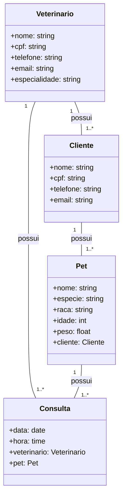

## Integrantes do grupo
João Felipe Maranhão da Silva Pereira - RA 2100450

---

URL do Board: https://github.com/users/joaomaranhao/projects/2/views/1

---

## Descrição do projeto

Sistema para gerenciar agendamento de consultas para uma clínica veterinária.

## Lista de requisitos

- SS01 - o sistema deve realizar o cadastro de veterinários
- SS02 - o sistema deve realizar o cadastro de clientes
- SS03 - o sistema deve realizar o cadastro de pets
- SS04 - o sistema deve realizar o cadastro do agendamento da consulta

---

## Arquitetura do projeto

- Servidor
    - FastAPI
    
- Cliente
    - ReactJS
    - Tailwind

- Banco de dados
    - PostgreSQL

---

## Diagrama de classes

